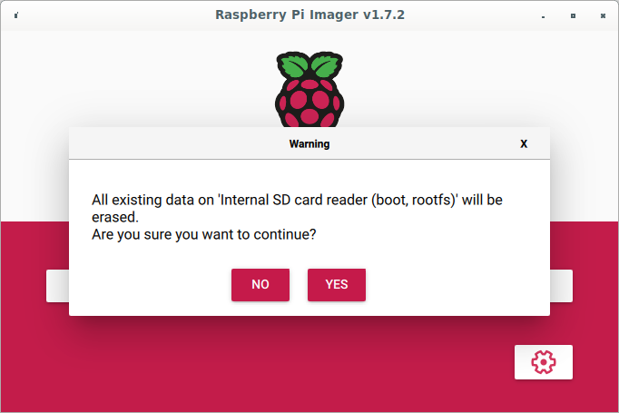

:::::::::::::::::::::::::::::::::::::: questions

- Where do you download the Raspberry Pi Imager from?
- Where do you download the CarpentriesOffline image from?
- How do you install the Raspberry Pi imager on your computer?
- What is the CarpentriesOffline image?
- What is the Raspberry Pi Imager used for?

::::::::::::::::::::::::::::::::::::::::::::::::

::::::::::::::::::::::::::::::::::::: objectives

- download and install the Raspberry Pi imager
- download and install the CarpentriesOffline image
- write the CarpentriesOffline image to the SD Card

::::::::::::::::::::::::::::::::::::::::::::::::
## Introduction
Every computer needs to load an operating system when you switch it on.
Therefore it will usually have a default place where it will look for an
operating system in the first place. The process of loading the operating system
is called **booting**. In general, if someone tells you to reboot your computer
it means to switch is off and switch it back on again so that the operating
system can be loaded from scratch. In the case of your desktop or laptop
computers you will have a hard drive built into the computer or alternatively
you might be able to boot from a USB device.

In the case of the Raspberry Pi its default booting device is an SD card.
Pre-RPi3 used a mini-SD card but RPi3 and RPi4 use micro-SD cards. SD cards are
available in various capacities, ie. the amount of information that can be
stored on it. A basic operating system for the Pi will probably take about 2GB
but then you will also need space for all the Carpentries lesson files and other
software that you want to make available to the learners.

Usually when you buy a RPi you can also buy an SD card with the operating system
pre-loaded. Alternatively you can buy an empty SD card and prepare it yourself.
Preparing the SD card involves downloading an **image** of the operating system
(and there are various versions available), downloading the software, Raspberry
Pi Imager, required for writing the image to the SD card and then using the
software to write the image to the SD card.

Internet connectivity might prove to be a problem during this workshop so your
instructor might bring an image along that can be copied or perhaps they will
provide pre-prepared microSD cards.

::: challenge
## Challenge 1: What software do you need to prepare an SD card?
1. Word 2. Excel 3. Raspberry Pi Imager 4. LibreOffice 5. SonicPi

:::::: solution
1. Word cannot be used to prepare an SD card, it is a word processor 3. Excel
cannot be used to prepare an SD card, it is a spreadsheet 4. The correct answer
is *3* 5. LibreOffice is an office suite and connot be used to prepare an SD
card 6. SonicPi is a live coding environment to support computing and music
lessons in schools.

::::::
:::
::: challenge
## Challenge 2: Where would you find the CarpentriesOffline image?
1. On the Raspberry Pi website 2. On The Carpentries website 3. On the
CarpentriesOffline website 4. On the Microsoft website?
:::::: solution
::::::
:::

If you have not already done so you have to download and install the Raspberry
Pi Imager. Using your browser, navigate to the Raspberry Pi [download
page](https://www.raspberrypi.com/software/). You should now be able to select
the download for your operating system. Click on the appropriate link and save
the installation file to your computer. The web page will provide further
information for installing the software on your computer.
Once the installation is complete you should be able to run the Imager which
will open with the following screen:

{alt='An image of the
Raspberry Pi Imager software intro screen'}

You can now click on the **Choose OS** button which will open a window for
selecting the image you want to write to the SD card. Scroll down to the bottom
where you should find an option **Use custom**. Click on that option:

{alt='An image
of the RPi Imager software screen for selecting an image to be written to the SD
card'}

Navigate to where you saved the CarpentriesOffline image and select it. Make
sure you have inserted the SD card into your computer. Now click on the **Choose
Storage** button and select the device you want to write the image to: 

{alt='An image of the
RPi Imager software screen for selecting the device to be written to'}

Once you have selected the Storage device, click the **WRITE** button. You will
be prompted to overwrite the information on the SD card, click on **YES** to
accept.

{alt='An image of
the RPi Imager software screen for confirming to overwrite the SD card'}

The image will now be written to the SD card.
{alt='An image of the RPi Imager
software screen while writing the image to the SD card'}

Once the image has been written to the SD card a **Write Successful** message
will be displayed.

{alt='An image of the RPi Imager
software screen after the image has been written succesfully.'}

You can now remove the SD card from your computer and insert it into the
Raspberry Pi.

::::::::::::::::::::::::::::::::::::: keypoints

- Know where to download the Raspberry Pi Imager from
- Know how to install the Raspberry Pi Imager
- Know where to download the CarpentriesOffline RPi image
- Know how to write the CarpentriesOffline image to an SD card

::::::::::::::::::::::::::::::::::::::::::::::::
[r-markdown]: https://rmarkdown.rstudio.com/
